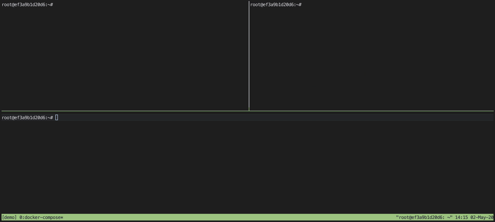

# P2P Tech Demo

 [](https://codecov.io/gh/42milez/p2p-techdemo)

# Overview

P2P Tech Demo demonstrates peer-to-peer networking. One peer becomes host, and other peers can send data through the host (broadcast/unicast).

# Demo



# Quick Start

Start dev server:

```
docker-compose -f docker-compose.dev.yml up -d dev_server
```

Run all tests:

```
docker-compose -f docker-compose.test.yml run --rm all_tests
```

Build for release:

```
docker-compose -f docker-compose.release.yml run --rm build
```

# Development

If you use CLion, remote debugging is available: [Remote Debugging with CLion](https://github.com/42milez/p2p-techdemo/wiki/Remote-Debugging-with-CLion)

# Supported OS

- Linux

# Technologies used

- Reliable UDP (inspired by [ENet](https://github.com/lsalzman/enet))
  - Window Control
  - Flow Control

# Road map

- Traffic Encryption
- Data Compression
- IPv6 support

# References

- [ENet](https://github.com/lsalzman/enet) : Reliable UDP networking library
- [Godot Engine](https://github.com/godotengine/godot) : Multi-platform 2D and 3D game engine
- [Mozc](https://github.com/google/mozc) : Japanese Input Method Editor designed for multi-platform
- [quiche](https://quiche.googlesource.com/quiche/) : Google's implementation of QUIC and related protocols
